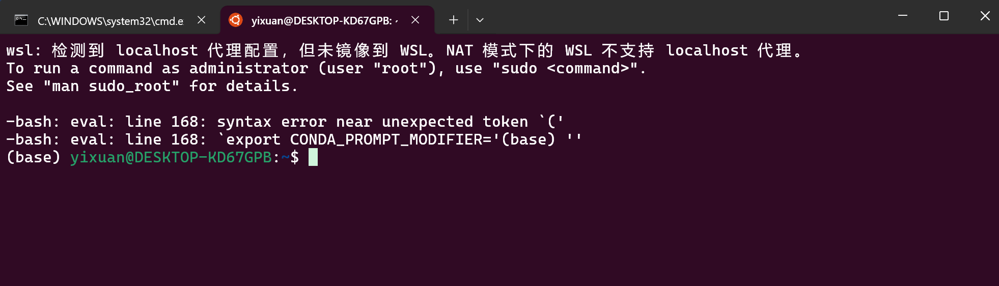

# WSL-Path-Resolution-and-Conda-Eval-Failure
解决 WSL 中 Windows 用户名特殊字符导致 Conda 中 eval 初始化崩溃的系统性方案  
Case study: WSL + Conda failure caused by Windows username containing special characters
# 解决 WSL 环境中由路径特殊字符引起的 Shell 解析故障
> **优势**：恰好能为不想因Windows用户名含有特殊字符不能正常使用WSL又不想重装系统或者解决需求急切提供简单且立刻起效措施

> **场景**: 在首次使用WSL的Ubuntu22时，在使用WSL中的Conda环境时，因 Windows 用户名包含单引号 `'` 导致 WSL 中的 Conda 无法启动。

---

## 1. 摘要 (Abstract)
在 Windows Subsystem for Linux (WSL) 环境中，由于 Windows 环境变量会自动映射至 Linux 层，当 Windows 用户名或路径中包含 Bash 敏感字符（如单引号 `'` 或括号 `()`）时，会导致 `conda` 初始化脚本在 `eval` 过程中发生语法解析错误。本文记录了一种基于“软链接路径映射”与“环境变量动态清洗”的非侵入式解决方案。

## 2. 问题定义 (Problem Statement)
在启动 WSL Ubuntu22 终端时，一启动就出现如下示例致命错误：

```bash
-bash: eval: line 168: syntax error near unexpected token '('
-bash: eval: line 168: `export CONDA_PROMPT_MODIFIER='(base) ''
```
**根源分析**：
Windows 和 WSL 之间通过 `WSLENV` 机制共享环境变量，使得 Windows 路径（如 `PATH`, `APPDATA`, `TEMP` 等）自动同步到 WSL 环境。然而，Bash Shell 对特殊字符的处理与 Windows 存在差异：
1. **单引号冲突**：当 Windows 用户名（例如 `yi'xuan`）包含单引号时，`conda` 等工具在初始化时，会尝试将路径（如 `/mnt/c/Users/yi'xuan/...`）用单引号包裹起来。Bash Shell 在解析 `export PATH='/mnt/c/Users/yi'xuan/...'` 这样的字符串时，会错误地将用户名的单引号作为字符串的结束符，导致后续内容被解析为无效命令，引发 `syntax error`。
2. **括号冲突**：Windows 系统中，`Program Files (x86)` 这类路径是常见的。当这些路径通过环境变量传入 WSL 时，`eval` 命令可能会尝试将其解析。Bash Shell 会将路径中的括号 `()` 误认为函数定义或子shell命令的语法，从而导致 `syntax error near unexpected token '('`。（以防万一，库主实现时没有遇到这个问题）

## 3. 失败的尝试 (Failed Attempts)
在达成最终方案前，我们探讨并放弃了以下路径，以证明本方案的必要性和有效性：（主要省时省力）
- **手动转义路径**：在 `.bashrc` 或 `.profile` 中尝试通过手动添加反斜杠 `\` 来转义特殊字符。
  * *缺陷：* 每次 Windows 环境变量导入都会刷新，手动修改效果短暂，无法根本解决。
- **修改 Windows 用户名/用户文件夹**：尝试直接在 Windows 系统中修改用户名或用户文件夹名称，移除特殊字符。
  * *缺陷：* 涉及大量注册表修改和权限重置，极易导致系统不稳定、软件无法启动甚至数据丢失，风险极高，且不适用于已有大量软件配置的复杂环境。
- **禁用 WSL 路径共享 (Interop)**：通过修改 `/etc/wsl.conf` 文件，设置 `[interop]` 下的 `appendWindowsPath = false` 来阻止 Windows 路径导入 WSL。
  * *缺陷：* 虽然可以解决路径污染问题，但这样做会严重破坏 WSL 与 Windows 之间的互操作性。例如，将无法在 WSL 终端中直接调用 Windows 应用程序（如 `code .` 启动 VS Code，或调用 Windows 版 Git），严重影响跨平台开发效率和体验。
- **重装 Conda / WSL / Windows**：
  * *缺陷：* 耗时巨大，且如果问题根源（Windows 用户名）未解决，则重装后仍再次遇到相同问题。

## 4. 核心解决方案 (Proposed Solution)

我们提出的方案是结合 **Symbolic Link** (软链接) 和 **Dynamic Environment Sanitization Script** (环境变量动态清洗脚本)，实现对“问题路径”的逻辑隔离与替换。

### 4.1. 路径逻辑重映射 (Symbolic Link)
在 WSL 文件系统层，创建一个“干净”的逻辑路径，使其指向 Windows 文件系统中包含特殊字符的物理路径。这样，Bash 或 Conda 在处理路径时，可以引用这个没有特殊字符的逻辑路径，而无需直接接触原始的“问题路径”。

**操作步骤**：
在 WSL 终端中执行：
```bash
sudo ln -s "/mnt/c/Users/yi'xuan" /mnt/c/Users/yixuan_wsl
```
*   **命令解释**：
    *   将`yi'xuan`和`yixuan_wsl`分别替换成你真实使用中有特殊字符的用户名 和 你想要在 WSL 软链接的用户名
    *   `sudo ln -s`：以管理员权限创建一个软链接 (symbolic link)。
    *   `"/mnt/c/Users/yi'xuan"`：这是 Windows 用户文件夹在 WSL 中的挂载路径，**请替换为你实际的带单引号的 Windows 用户名路径**。
    *   `/mnt/c/Users/yixuan_wsl`：这是一个新的、不含特殊字符的逻辑路径。你可以根据喜好命名，但建议简短、有意义。
*   **原理**：软链接是在 Linux 文件系统的 Inode 层建立的一个指向。它不是复制文件，而是创建了一个“快捷方式”。Linux 系统在访问 `/mnt/c/Users/yixuan_wsl` 时，会自动透明地重定向到 `/mnt/c/Users/yi'xuan`。对于 Shell 来说，它只需要处理 `/mnt/c/Users/yixuan_wsl` 这个干净的路径。

### 4.2. 环境变量全局清洗脚本 (Dynamic Environment Sanitization Script)
在 `~/.bashrc` 文件的最顶部（确保在 Conda 初始化脚本之前执行），添加一个 Bash 脚本，用于在每次 Shell 启动时，动态地扫描并替换所有环境变量中包含“问题路径”的部分。

**操作步骤**：
1.  打开 `~/.bashrc` 文件（例如，在 WSL 终端中输入 `nano ~/.bashrc` 或 `code ~/.bashrc`）。
2.  将以下代码块粘贴到文件的 **最顶部**。

```bash
# ==========================================
# 全局路径重构：解决用户名特殊字符(单引号 ' )引发的 eval 崩溃
# ==========================================

# 1. 首先抹除那两个带括号的非法变量名（变量名带括号是 Bash 的死穴，保险起见）
unset "ProgramFiles(x86)"
unset "CommonProgramFiles(x86)"

# 2. 【核心】遍历所有环境变量，把含有单引号路径的 Value 全部置换成软链接路径
# 这个循环会扫描几十个变量（PATH, APPDATA, TEMP 等）
# 只要值里面包含 yi'xuan(举例)，就自动换成 yixuan_wsl(此处换成所需的无特殊字符名字)
while read -r line; do
    if [[ "$line" == *"yi'xuan"* ]]; then
        # 提取变量名
        var_name=$(echo "$line" | cut -d'=' -f1)
        # 提取旧值并替换
        old_value=$(eval echo \$$var_name)
        new_value="${old_value//yi\'xuan/yixuan_wsl}"
        # 重新导出干净的变量
        export "$var_name"="$new_value"
    fi
done < <(env)

# ==========================================
```
*   **脚本解释**：
    *   `unset "ProgramFiles(x86)" ...`：直接移除 Bash 无法处理的带有括号的环境变量名称，避免 Bash 语法错误。
    *   `while read -r line; do ... done < <(env)`：循环遍历当前 Shell 环境中的所有环境变量。
    *   `if [[ "$line" == *"yi'xuan"* ]]; then`：检查当前环境变量的值是否包含你的“问题用户名”。**请务必将 `yi'xuan` 替换为你的实际 Windows 用户名（含特殊字符）**。
    *   `var_name=$(echo "$line" | cut -d'=' -f1)`：提取环境变量的名称。
    *   `old_value=$(eval echo \$$var_name)`：获取当前环境变量的原始值。
    *   `new_value="${old_value//yi\'xuan/yixuan_wsl}"`：使用 Bash 的字符串替换功能，将环境变量值中所有 `yi'xuan` (需要转义) 替换为 `yixuan_wsl`。**请务必将 `yi\'xuan` 和 `yixuan_wsl` 替换为你设置的实际值**。
    *   `export "$var_name"="$new_value"`：将清洗后的新值重新导出为环境变量。
*   **原理**：这个脚本在任何其他 Shell 配置文件（包括 Conda 的初始化脚本）执行之前运行。它在内存中“净化”了所有受影响的环境变量，确保后续程序（如 Conda）在读取这些变量时，看到的是已经被替换过的、干净的路径，从而避免了语法解析错误。

### 4.3. 解决方案设计细节与考量 (Solution Design Details & Considerations)

#### 4.3.1 设计灵活性：软链接名称是否可以更改？ (Design Flexibility: Can the Symbolic Link Name Be Changed?)
**简短回答**：是的，软链接名称（例如我们示例中的 `yixuan_wsl`）可以安全地更改。然而，`.bashrc` 中的替换逻辑**必须相应地更新**以反映新名称。

这解决了解决方案固有的**设计灵活性**问题。所选的软链接名称并非永久固定，允许在需要时进行调整。

**为何安全（风险评估）？ (Why It Is Safe - Risk Assessment)**：
使用以下命令创建的软链接：
```bash
sudo ln -s "/mnt/c/Users/yi'xuan" /mnt/c/Users/yixuan_wsl
```
**不会**修改任何底层 Windows 文件系统数据。它纯粹是在 **Linux 虚拟文件系统层内部**创建一个 inode 级别的别名。这是**风险评估**的关键方面。因此：
*   删除软链接**不会**删除您的 Windows 用户目录中的任何真实数据。
*   在 WSL 中重命名或删除软链接**不会**影响原始 Windows 文件或 Windows 操作系统本身。
*   它仅作为 Linux 环境中的一个命名空间抽象而存在。

**为何无法随意重命名而不更新脚本？ (Why It Cannot Be Renamed Arbitrarily Without Updating the Script?)**：
环境变量清洗脚本（`patch_bashrc.sh` 或直接在 `.bashrc` 中）包含硬编码的替换规则，例如：
```bash
new_value="${old_value//yi\'xuan/yixuan_wsl}"
```
如果软链接名称更改（例如从 `yixuan_wsl` 更改为 `dev_home`），但此替换规则保持不变，则环境变量将继续引用旧的、现已不存在的路径 (`yixuan_wsl`)。这将导致运行时错误再次出现，因为 Shell 会尝试解析不再指向预期位置的路径。

**正确的重命名过程 (Correct Renaming Procedure)**：
如果您决定重命名您的软链接（例如，从 `yixuan_wsl` 更改为 `dev_home`），请仔细遵循以下步骤：
1.  **删除旧的软链接**：
    ```bash
    sudo rm /mnt/c/Users/yixuan_wsl
    ```
2.  **创建新的软链接**：
    ```bash
    sudo ln -s "/mnt/c/Users/yi'xuan" /mnt/c/Users/dev_home
    ```
    （请记住，将 `"/mnt/c/Users/yi'xuan"` 替换为您实际有问题的 Windows 用户路径，将 `/mnt/c/Users/dev_home` 替换为您希望的新软链接路径）。
3.  **更新 `.bashrc` 脚本**：
    修改 `patch_bashrc.sh` 中（或直接在 `.bashrc` 中）的 `new_value` 行，以反映新的软链接名称：
    ```bash
    new_value="${old_value//yi\'xuan/dev_home}"
    ```
    （同样，将 `yi\'xuan` 替换为您实际有问题的 Windows 用户名，将 `dev_home` 替换为您的新软链接名称）。
4.  **重新加载 Shell**：
    ```bash
    source ~/.bashrc
    ```
    这确保更改在您当前的 Shell 会话中生效。

#### 4.3.2 可维护性：避免硬编码 (Maintainability: Avoiding Hardcoding)
最初的替换规则实现，例如 `new_value="${old_value//yi\'xuan/yixuan_wsl}"`，虽然功能正常，但涉及到**硬编码**目标软链接名称。这是一个**可维护性**方面的隐患。如果软链接名称将来需要更改，则需要在脚本中的多个位置进行修改。

为了提高**可维护性**并增强**设计质量**，建议在 `patch_bashrc.sh` 脚本的开头将净化后的用户路径定义为变量：
```bash
# --- 配置 ---
PROBLEM_USER_DIR="yi'xuan"       # 您的实际有问题的 Windows 用户名部分，例如 "yi'xuan"
SANITIZED_USER_LINK="yixuan_wsl" # 您希望的软链接名称，例如 "yixuan_wsl"
# -----------

# ... 脚本后面，使用这些变量 ...
# 示例：new_value="${old_value//$(echo ${PROBLEM_USER_DIR} | sed "s/'/\\\'/g")/${SANITIZED_USER_LINK}}"
# 这里的 $(echo ${PROBLEM_USER_DIR} | sed "s/'/\\\'/g") 是为了确保 PROBLEM_USER_DIR 中包含单引号时也能正确转义。
```
这种方法使得将来的更改仅限于一个变量定义，显著降低了出错风险并简化了更新。这代表了从仅仅“可用”的解决方案到“优雅”且健壮的解决方案的**工程级改进**。

#### 4.3.3 架构洞察：为何选择此解决方案而非其他？ (Architectural Insight: Why This Solution Over Others?)
此解决方案基于一个根本的**架构洞察**。它并非试图在多个复杂且可能相互冲突的解析层（这通常脆弱且难以维护）中，细致地转义特殊字符，而是有效地**从 Bash Shell 和其他 Linux 工具交互的活动命名空间中移除了问题符号**。

## 5. 实验验证 (Evaluation)
实施上述补丁后，我们验证了 WSL 环境的稳定性与功能性：
- **Shell 稳定性**：WSL 终端启动时不再报错，`conda` 环境 (`(base)`) 提示符正常显示，表明 Conda 初始化脚本已成功执行。
- **环境功能性**：成功安装并激活了 Python Conda 环境，并能够顺利运行，未出现任何因路径问题导致的错误。
- **兼容性**：VS Code 的 Remote-WSL 插件能够正常连接并访问通过软链接重映射的文件系统，Windows 与 WSL 之间的文件互操作性保持良好。

## 6. 结论 (Conclusion)
本研究案例突出表明了在复杂跨平台开发环境中，操作系统底层差异（如 Bash 对特殊字符的敏感性）可能导致看似“玄学”的环境问题。通过结合 Linux 文件系统层面的软链接特性和 Bash Shell 的动态变量清洗能力，我们成功提供了一种非侵入式、可维护且高效的解决方案，绕过了 Windows 用户名中特殊字符在 WSL 环境中引发的 `eval` 语法错误。本方案为在类似受限环境下进行科研和开发的用户提供了宝贵的经验。
